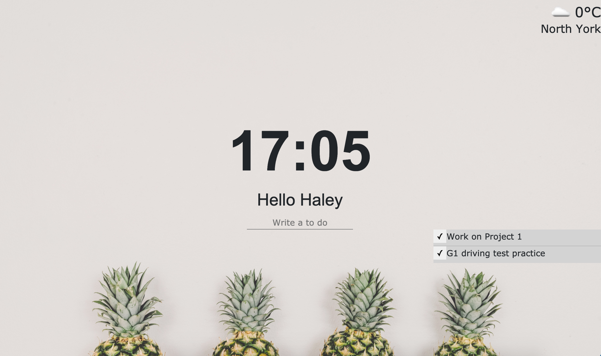

# Google-Momentum

This is the page that is inspired by the momentum extension that provided by Google. Set a daily focus, and track your to-dos with various background images.

deployed site: https://tndus604.github.io/google-momentum/

## Features
- Inspirational random background photos.
- Use of geolocation to search for your current weather and city.
- Make and track your to-do lists.
- Real time clock function.

## Technologies
| Technologies Used  | Links |
| ------------- | ------------- |
| OpenWeather API  | https://openweathermap.org/  |
| Background Image  | https://unsplash.com/  |
